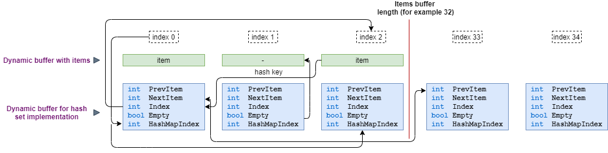
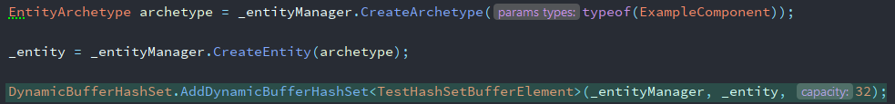
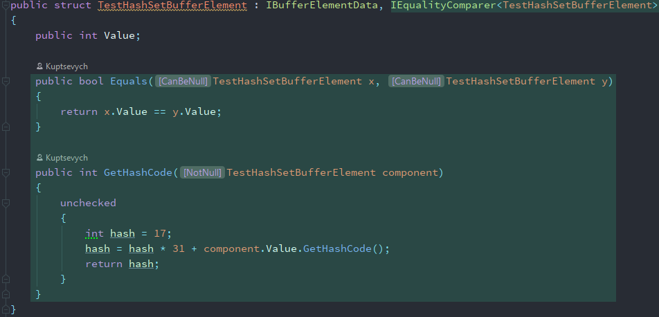
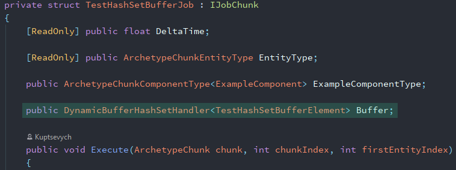
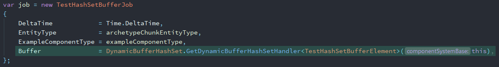
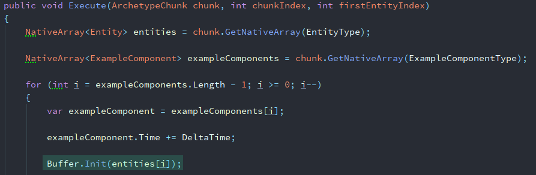
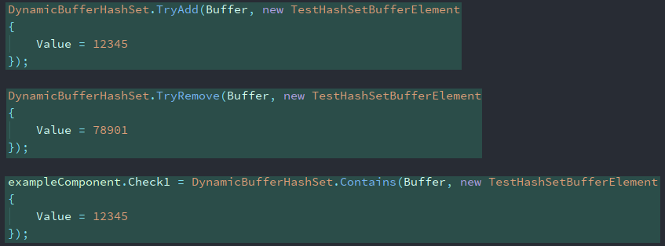

# Unity-DOTS-DynamicBufferHashSet

HashSet functionality for DynamicBuffer

##Core idea

The main idea is to create two buffers, the first for storing user elements, and the second for implementing a hash set.

Two buffers are created. One directly for the user elements and the second one is to implement a hash setfunctionality.
The buffer with user elements is fixed in size, but the buffer for the hash set is not. Thus, the second buffer goes beyond 
the size of the first one and allows you to create chains of elements with the same hash key.

##How to use

### Step 1

Add your dynamic buffer to entity

### Step 2

Implement IEqualityComparer<T> interface for your dynamic buffer element

### Step 3

Add dynamic buffer to job system

### Step 5

Init hash set buffer handler

### Step 6

Use hash set functionality

	
	
##Limitations
	
You can add only one hash set buffer per entity.